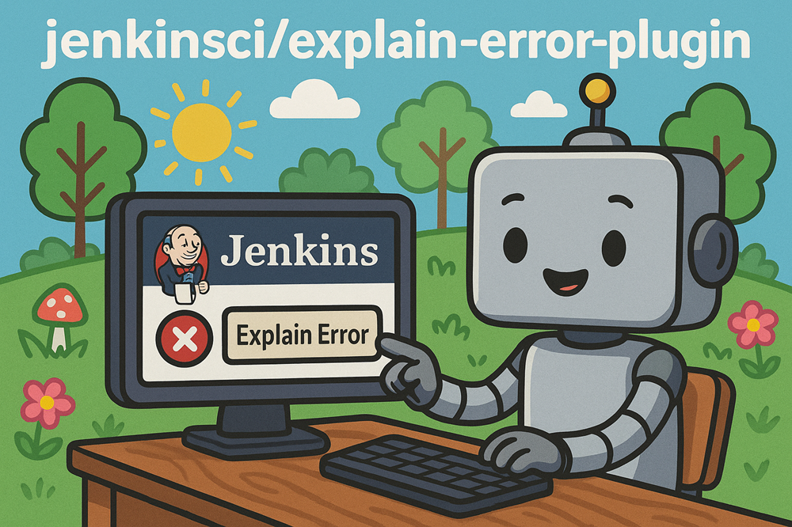
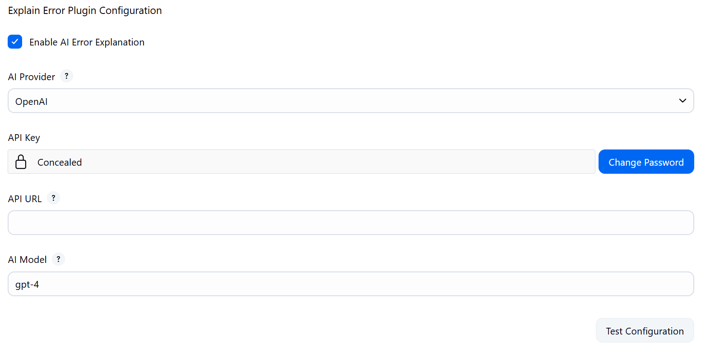
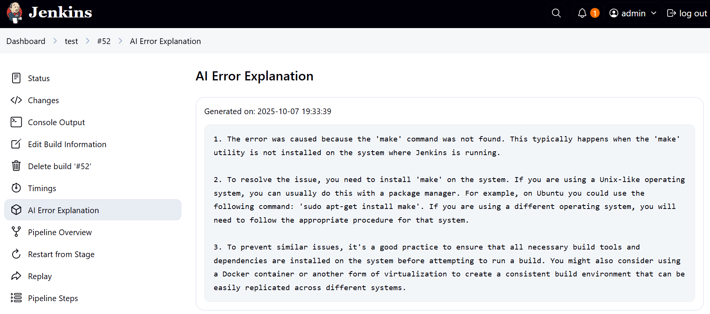
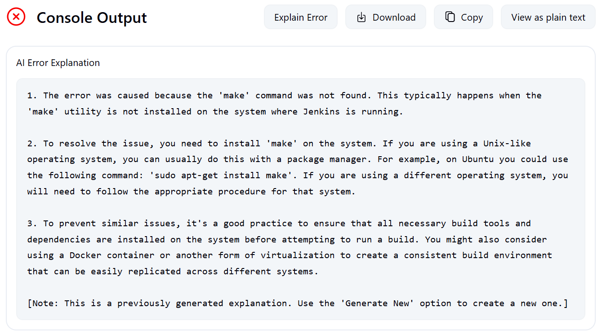

<p align="center">
  
</p>

<h1 align="center">Gemini Jenkins Analyzer — Jenkins Plugin</h1>
<p align="center">🤖 AI-powered plugin that analyzes Jenkins job failures with human-readable insights.</p>

<p align="center">
  <a href="https://github.com/jenkinsci/gemini-jenkins-analyzer-plugin/releases/latest">
    
  </a>
  
</p>

---

## 🎥 Demo

👉 [Watch the hands-on demo on YouTube](https://youtu.be/rPI9PMeDQ2o?si=YMeprtSz9VmqglCL) — setup, run, and see how AI explains your Jenkins job failures.

---

## Overview

Tired of digging through long Jenkins logs to understand what went wrong?

**Gemini Jenkins Analyzer** leverages AI to automatically interpret job and pipeline failures—saving you time and helping you fix issues faster.

Whether it’s a compilation error, test failure, or deployment hiccup, this plugin turns confusing logs into human-readable insights.

## Key Features

* **One-click error analysis** on any console output
* **Pipeline-ready** with a simple `explainError()` step
* **AI-powered explanations** via OpenAI GPT models, Google Gemini or local Ollama models
* **Smart provider management** — LangChain4j handles most providers automatically
* **Customizable**: set provider, model, API endpoint (enterprise-ready)[^1], log filters, and more

[^1]: *Enterprise-ready API endpoints support custom URLs for OpenAI-compatible services (LocalAI, DeepSeek), air-gapped environments.*

## Quick Start

### Prerequisites

- Jenkins 2.479.3+
- Java 17+
- AI API Key (OpenAI or Google)

### Installation

**Manual Installation:**
1. Build the plugin from source or download the `.hpi` file from [GitHub releases](https://github.com/jenkinsci/gemini-jenkins-analyzer-plugin/releases/)
2. Upload via `Manage Jenkins` → `Manage Plugins` → `Advanced`
3. Restart Jenkins

### Configuration

1. Go to `Manage Jenkins` → `Configure System`
2. Find the **"Gemini Jenkins Analyzer Configuration"** section
3. Configure the following settings:

| Setting | Description | Default |
|---------|-------------|---------|
| **Enable AI Error Explanation** | Toggle plugin functionality | ✅ Enabled |
| **AI Provider** | Choose between OpenAI, Google Gemini, or Ollama  | `OpenAI` |
| **API Key** | Your AI provider API key | Get from [OpenAI](https://platform.openai.com/settings) or [Google AI Studio](https://aistudio.google.com/app/apikey) |
| **API URL** | AI service endpoint | **Leave empty** for official APIs (OpenAI, Gemini). **Specify custom URL** for OpenAI-compatible services and air-gapped environments. |
| **AI Model** | Model to use for analysis | *Required*.  Specify the model name offered by your selected AI provider |

4. Click **"Test Configuration"** to verify your setup
5. Save the configuration



### Configuration as Code (CasC)

This plugin supports [Configuration as Code](https://plugins.jenkins.io/configuration-as-code/) for automated setup. Use the `geminiAnalyzer` symbol in your YAML configuration:

**OpenAI Configuration:**
```yaml
unclassified:
  geminiAnalyzer:
    enableExplanation: true
    provider: "OPENAI"
    apiKey: "${AI_API_KEY}"
    model: "gpt-4"
    # apiUrl: "" # Optional, leave empty for default
```

**Google Gemini Configuration:**
```yaml
unclassified:
  geminiAnalyzer:
    enableExplanation: true
    provider: "GEMINI"
    apiKey: "${AI_API_KEY}"
    model: "gemini-2.0-flash"
    # apiUrl: "" # Optional, leave empty for default
```

**Ollama Configuration:**
```yaml
unclassified:
  geminiAnalyzer:
    enableExplanation: true
    provider: "OLLAMA"
    apiUrl: "http://localhost:11434"
    model: "gemma3:1b" # gpt-oss, deepseek-r1, etc
```

**Environment Variable Example:**
```bash
export AI_API_KEY="your-api-key-here"
```

This allows you to manage the plugin configuration alongside your other Jenkins settings in version control.

## Supported AI Providers

### OpenAI
- **Models**: `gpt-4`, `gpt-4-turbo`, `gpt-3.5-turbo`, etc.
- **API Key**: Get from [OpenAI Platform](https://platform.openai.com/settings)
- **Endpoint**: Leave empty for official OpenAI API, or specify custom URL for OpenAI-compatible services
- **Best for**: Comprehensive error analysis with excellent reasoning

### Google Gemini
- **Models**: `gemini-2.0-flash`, `gemini-2.0-flash-lite`, `gemini-2.5-flash`, etc.
- **API Key**: Get from [Google AI Studio](https://aistudio.google.com/app/apikey)
- **Endpoint**: Leave empty for official Google AI API, or specify custom URL for Gemini-compatible services
- **Best for**: Fast, efficient analysis with competitive quality

### Ollama (Local/Private LLM)
- **Models**: `gemma3:1b`, `gpt-oss`, `deepseek-r1`, and any model available in your Ollama instance
- **API Key**: Not required by default (unless your Ollama server is secured)
- **Endpoint**: `http://localhost:11434` (or your Ollama server URL)
- **Best for**: Private, local, or open-source LLMs; no external API usage or cost

## Usage

### Method 1: Pipeline Step

Use `analyzeError()` in your pipeline (e.g., in a `post` block):

```groovy
pipeline {
    agent any
    stages {
        stage('Build') {
            steps {
                script {
                    // Your build steps here
                    sh 'make build'
                }
            }
        }
    }
    post {
        failure {
            // Automatically analyze errors when build fails
            analyzeError()
        }
    }
}
```

Optional parameters:

```groovy
analyzeError(
  maxLines: 500,
  logPattern: '(?i)(error|failed|exception)'
)
```
Output appears in the sidebar of the failed job.



### Method 2: Manual Console Analysis

Works with Freestyle, Declarative, or any job type.

1. Go to the failed build's console output
2. Click **Analyze Error** button in the top
3. View results directly under the button



## Troubleshooting

| Issue | Solution |
|-------|----------|
|API key not set	| Add your key in Jenkins global config |
|Auth or rate limit error| Check key validity, quota, and provider plan |
|Button not visible	| Ensure Jenkins version ≥ 2.479.3, restart Jenkins after installation |

Enable debug logs:

`Manage Jenkins` → `System Log` → Add logger for `io.jenkins.plugins.gemini_jenkins_analyzer`

## Best Practices

1. Use `analyzeError()` in `post { failure { ... } }` blocks
2. Apply `logPattern` to focus on relevant errors
3. Monitor your AI provider usage to control costs
4. Keep plugin updated regularly

## Support & Community

- [GitHub Issues](https://github.com/jenkinsci/gemini-jenkins-analyzer-plugin/issues) for bug reports and feature requests
- [Contributing Guide](CONTRIBUTING.md) if you'd like to help
- Security concerns? Report via [GitHub Security Advisories](https://github.com/jenkinsci/gemini-jenkins-analyzer-plugin/security/advisories)

## License

Licensed under the [MIT License](LICENSE.md).

## Acknowledgments

Built for the Jenkins community.
If you find it useful, please star us on GitHub!
